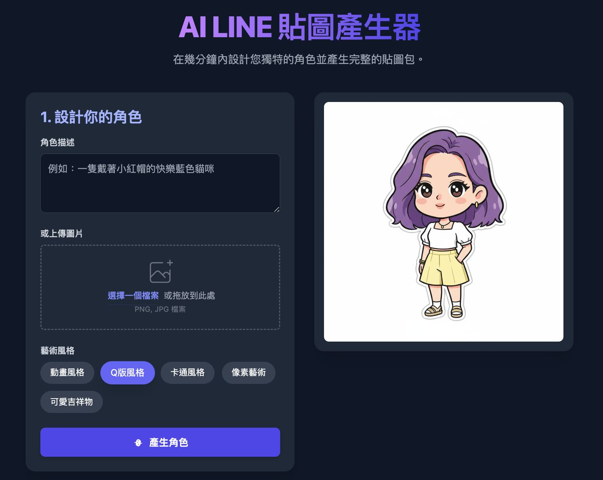
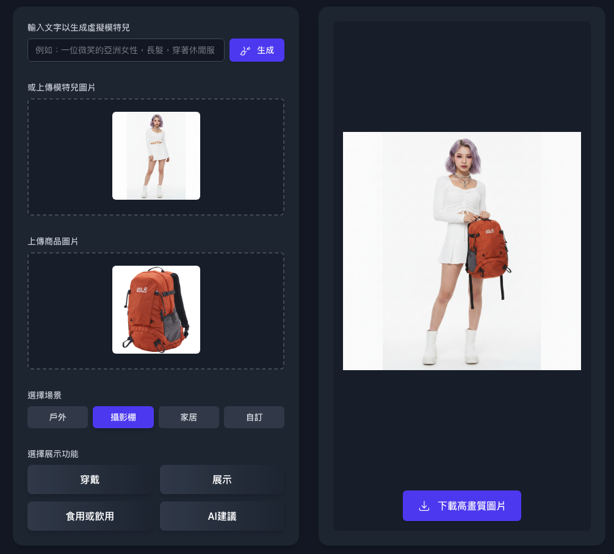
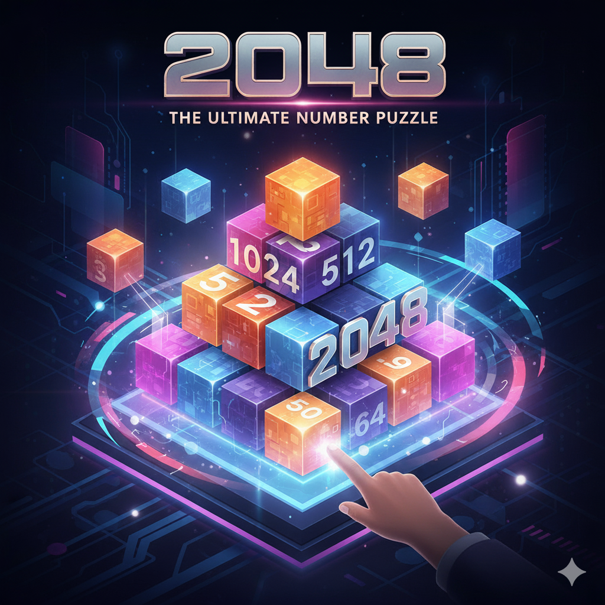

## Phil AI Studio 專案

 ### 這裡主要是我透過 AI Studio 以及 Gemini Canvas，透過對話的方式創造的一些生活小工具。

 ### 我主要在 Notion 使用圖庫的瀏覽模式排版好，再透過同步按鈕送到 GitHub 

 ### 歡迎自由取用與交流 

<table border='0'><tr>
<td width="33%" valign="top">
  
   
  

    圖片 
    <strong style="font-size: 1.1em; display: block; margin-top: 5px;">韓劇電影感的個人藝術照（單張）</strong>
    
上傳個人照片，選擇喜愛的季節，創作一幅充滿韓劇電影感的個人藝術照片。

    <a href="https://ai.studio/apps/drive/1BssegwXp9uQPFaVU4OmXxOT132mdZ0PH?fullscreenApplet=true" target="_blank" style="text-decoration: none; color: #0366d6;">🚀 啟動專案</a>
  

</td>
<td width="33%" valign="top">
  
   
  

    圖片 
    <strong style="font-size: 1.1em; display: block; margin-top: 5px;">韓劇電影感的個人藝術照（遠中近）</strong>
    
上傳個人照片，選擇喜愛的季節，創作一幅包含遠中近充滿韓劇電影感的藝術照片

    <a href="https://ai.studio/apps/drive/1uCR8pReGWXd5uVoi_Tt7NytkenfUYaoA?fullscreenApplet=true" target="_blank" style="text-decoration: none; color: #0366d6;">🚀 啟動專案</a>
  

</td>
<td width="33%" valign="top">
  
   
  

    圖片 
    <strong style="font-size: 1.1em; display: block; margin-top: 5px;">早安圖產生器</strong>
    
上傳圖片，創造獨一無二的問候圖！

    <a href="https://ai.studio/apps/b0b65972-391a-45fc-9280-baf21e23042f?fullscreenApplet=true" target="_blank" style="text-decoration: none; color: #0366d6;">🚀 啟動專案</a>
  

</td></tr><tr>
<td width="33%" valign="top">
  
   
  

    圖片 
    <strong style="font-size: 1.1em; display: block; margin-top: 5px;">LINE 貼圖角色產生器</strong>
    
設計角色並產生一套帶有自訂文字和姿勢的完整 LINE 貼圖。

    <a href="https://ai.studio/apps/2302795a-a0e6-4534-bc6c-b69ef10d21bc?fullscreenApplet=true" target="_blank" style="text-decoration: none; color: #0366d6;">🚀 啟動專案</a>
  

</td>
<td width="33%" valign="top">
  
   
  

    寫作 
    <strong style="font-size: 1.1em; display: block; margin-top: 5px;">春節親戚靈魂拷問生存模擬器</strong>
    
輸入長輩那句讓你翻白眼的話，選擇優雅（或火爆）回擊

    <a href="https://gemini.google.com/share/aee4dbd6e9d0" target="_blank" style="text-decoration: none; color: #0366d6;">🚀 啟動專案</a>
  

</td>
<td width="33%" valign="top">
  
   
  

    圖片 
    <strong style="font-size: 1.1em; display: block; margin-top: 5px;">電商商品展示圖片產生器</strong>
    
透過文字或者是上傳模特兒圖片，再上傳商品的圖片，產生不同風格的商品展示照

    <a href="https://ai.studio/apps/ec466d0e-b5ec-4707-9db5-c884fc55c803?fullscreenApplet=true" target="_blank" style="text-decoration: none; color: #0366d6;">🚀 啟動專案</a>
  

</td></tr><tr>
<td width="33%" valign="top">
  
   
  

    圖片 
    <strong style="font-size: 1.1em; display: block; margin-top: 5px;">運動雜誌封面產生器</strong>
    
將你的照片變成專業、動感的運動攝影大作！

    <a href="https://ai.studio/apps/drive/1eY4Au1O7PL5dLCspg9xqamxrtE83ClWx?fullscreenApplet=true" target="_blank" style="text-decoration: none; color: #0366d6;">🚀 啟動專案</a>
  

</td>
<td width="33%" valign="top">
  
   
  

    圖片 
    <strong style="font-size: 1.1em; display: block; margin-top: 5px;">形象照產生器</strong>
    
上傳大頭照變成形象照

    <a href="https://gemini.google.com/share/271bd0c17b1d" target="_blank" style="text-decoration: none; color: #0366d6;">🚀 啟動專案</a>
  

</td>
<td width="33%" valign="top">
  
   
  

    遊戲 
    <strong style="font-size: 1.1em; display: block; margin-top: 5px;">機關算盡 華容道</strong>
    
經典遊戲

    <a href="https://ai.studio/apps/drive/1j9ug41zHj8uPus3fyPVOjq3aEgLXUZYM?fullscreenApplet=true" target="_blank" style="text-decoration: none; color: #0366d6;">🚀 啟動專案</a>
  

</td></tr><tr>
<td width="33%" valign="top">
  
   
  

    遊戲 
    <strong style="font-size: 1.1em; display: block; margin-top: 5px;">2048</strong>
    
經典遊戲，手機跟鍵盤都可以操作

    <a href="https://ai.studio/apps/0680c5a9-5344-487c-a9fc-7d59d9d3b570?fullscreenApplet=true" target="_blank" style="text-decoration: none; color: #0366d6;">🚀 啟動專案</a>
  

</td></tr></table>

---
*最後更新時間：2026-04-23 19:58:41*